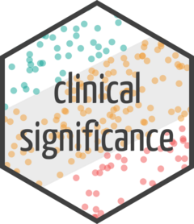

# clinicalsignificance 

[](https://CRAN.R-project.org/package=clinicalsignificance)
[](https://cran.r-project.org/package=clinicalsignificance)
[](https://github.com/benediktclaus/clinicalsignificance/actions/workflows/R-CMD-check.yaml)
The **clinicalsignificance** R package provides a comprehensive toolkit
for analyzing **clinical significance** in intervention studies.

> **Why this package?** While *statistical* significance asks: *“Is this
> effect unlikely due to chance?”* Clinical significance asks: **“Does
> this intervention make a meaningful difference for the patient?”**

This package empowers researchers and practitioners to move beyond
p-values and assess the practical relevance of treatment outcomes.

## 🛠 Core Functions

The package implements the most widely used methods for clinical
significance analysis. Each approach answers a specific question:

- **`cs_anchor()`**: *Did the patient improve by a minimal amount?*
  Evaluates change based on a predefined **Minimal Important Difference
  (MID)**.
- **`cs_percentage()`**: *Did the patient improve by a certain
  percentage?* Assesses change relative to the baseline score.
- **`cs_distribution()`**: *Is the change reliable (beyond measurement
  error)?* Uses statistical distribution metrics like the **Reliable
  Change Index (RCI)**.
- **`cs_statistical()`**: *Did the patient return to a functional
  range?* Determines if a patient moved from a clinical to a
  **functional population**.
- **`cs_combined()`**: *The “Gold Standard” (e.g., Jacobson & Truax).*
  Combines reliability and cutoff criteria for a robust assessment.

## 📦 Installation

Install the stable version from CRAN:

``` r
install.packages("clinicalsignificance")
```

Or the development version from GitHub:

``` r
# install.packages("pak")
pak::pak("benediktclaus/clinicalsignificance")
```

## 🚀 Example: The Combined Approach

Let’s look at the **combined approach** (Jacobson & Truax, 1991). We
want to know if patients in the `claus_2020` dataset (included in the
package) showed a **reliable change** AND moved into a **functional
population** range.

``` r
library(clinicalsignificance)
library(ggplot2)

# 1. Perform the analysis
results_combined <- claus_2020 |>
  cs_combined(
    id = id,
    time = time,
    outcome = bdi,
    pre = 1,
    post = 4,
    reliability = 0.801,
    m_functional = 7.69,
    sd_functional = 7.52,
    cutoff_type = "c"
  )

# 2. Visualize the results
plot(results_combined, show_group = "category")
#> Ignoring unknown labels:
#> • colour : "Group"
```


**Interpreting the Plot:** \* **Recovered (Green):** Reliable
improvement + moved to functional range. \* **Improved (Blue):**
Reliable improvement, but still in clinical range. \* **Unchanged
(Grey):** No reliable change. \* **Deteriorated (Red):** Reliable
worsening.

``` r
# 3. Get a summary table
summary(results_combined)
#> 
#> ---- Clinical Significance Results ----
#> 
#> Approach:     Distribution-based
#> RCI Method:   JT
#> N (original): 43
#> N (used):     40
#> Percent used: 93.02%
#> Outcome:      bdi
#> Cutoff Type:  c
#> Cutoff:       21.02
#> Outcome:      bdi
#> Reliability:  0.801
#> 
#> -- Cutoff Descriptives
#> 
#> M Clinical | SD Clinical | M Functional | SD Functional
#> -------------------------------------------------------
#> 35.48      |        8.16 |         7.69 |          7.52
#> 
#> 
#> -- Results
#> 
#> Category     |  N | Percent
#> ---------------------------
#> Recovered    | 10 |  25.00%
#> Improved     |  8 |  20.00%
#> Unchanged    | 22 |  55.00%
#> Deteriorated |  0 |   0.00%
#> Harmed       |  0 |   0.00%
```

## 📚 Learn More

- **Vignettes**: Detailed tutorials on all methods are available on the
  [**package
  website**](https://benediktclaus.github.io/clinicalsignificance/articles/).
- **Publication**: For the theoretical background, check out our paper
  in the [**Journal of Statistical
  Software**](https://doi.org/10.18637/jss.v111.i01).

## 📄 Citation

Please cite both the package and the JSS paper if you use
`clinicalsignificance` in your research.

> Claus, B. B., Wager, J., & Bonnet, U. (2024). clinicalsignificance:
> Clinical Significance Analyses of Intervention Studies in R. *Journal
> of Statistical Software*, *111*(1), 1–39.
> <https://doi.org/10.18637/jss.v111.i01>

<details>

<summary>

<strong>Click to show BibTeX</strong>
</summary>

``` bibtex
@article{JSS:v111:i01,
  author = {Benedikt B. Claus and Julia Wager and Udo Bonnet},
  title = {{clinicalsignificance}: Clinical Significance Analyses of Intervention Studies in {R}},
  journal = {Journal of Statistical Software},
  year = {2024},
  volume = {111},
  number = {1},
  pages = {1--39},
  doi = {10.18637/jss.v111.i01},
}

@manual{R-clinicalsignificance,
  title = {clinicalsignificance: A Toolbox for Clinical Significance Analyses in Intervention Studies},
  author = {Benedikt B. Claus},
  year = {2024},
  note = {R package version 2.1.0},
  doi = {10.32614/CRAN.package.clinicalsignificance},
  url = {[https://github.com/benediktclaus/clinicalsignificance/](https://github.com/benediktclaus/clinicalsignificance/)},
}
```

</details>

## 🤝 Contributing

Contributions are welcome! If you encounter bugs or have feature
requests: 1. Check the [Issue
Tracker](https://github.com/benediktclaus/clinicalsignificance/issues).
2. Submit a Pull Request.

------------------------------------------------------------------------

**License:** GNU General Public License v3.0  
Built with ❤️ for better clinical research.
